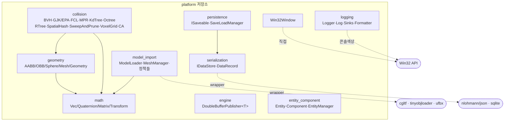
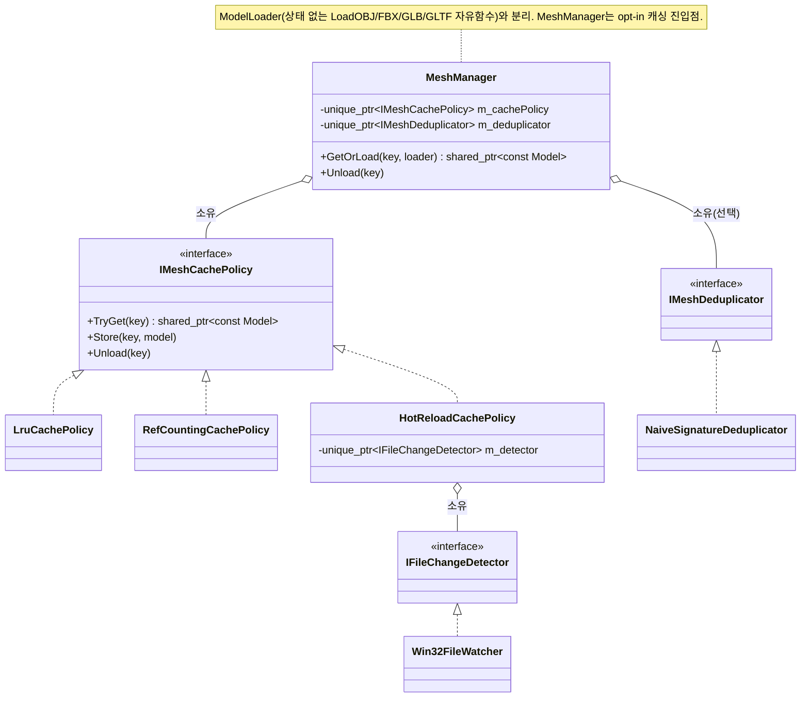
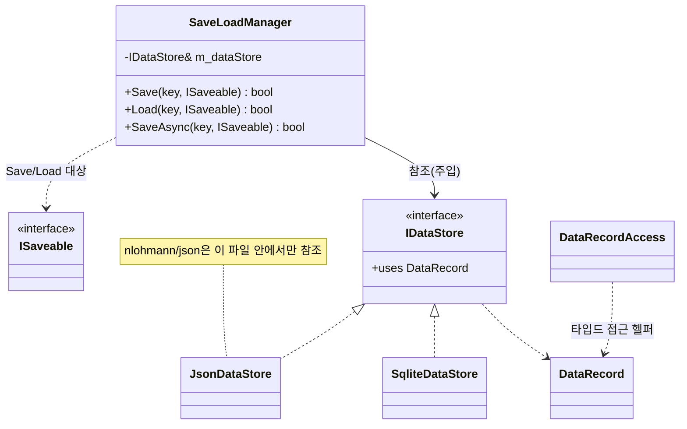
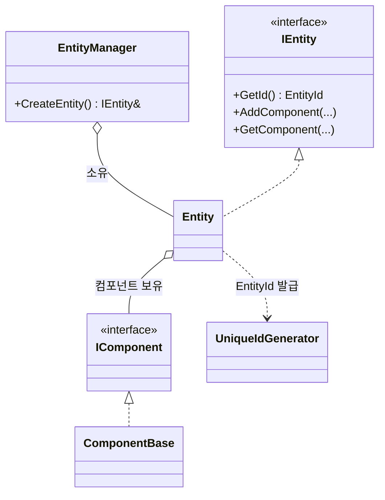
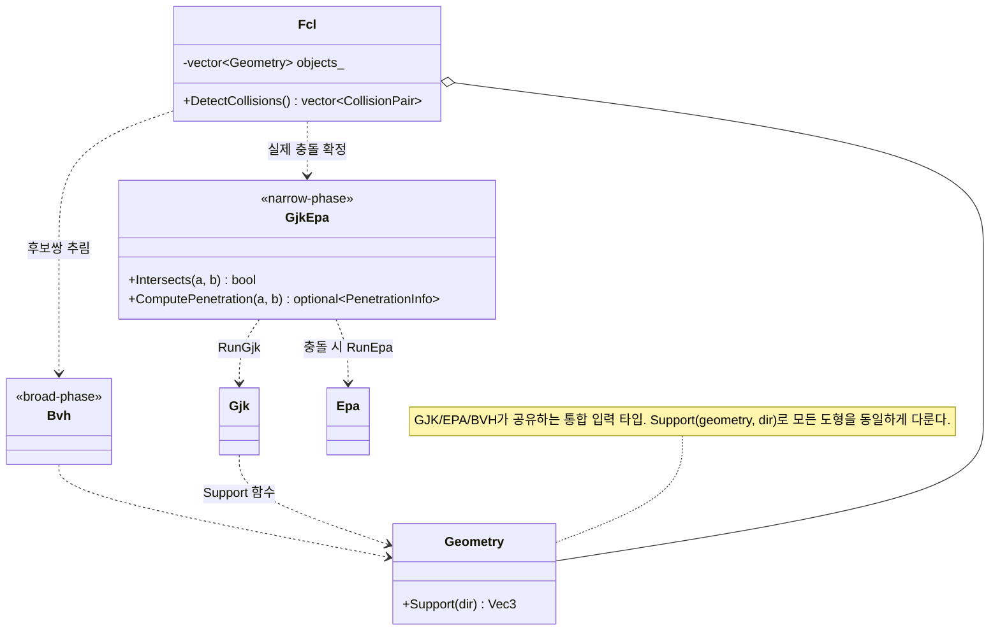

# 전체아키텍처 다이어그램 — platform (2026-08-31 02:12)

`agent_harness/.claude/commands/diagram_delegation.md` 워크플로우로 생성한 첫 스냅샷.
이 문서는 영구 보관하며, 다음 실행은 이 파일을 덮어쓰지 않고 새 날짜 파일을 추가한다.

---

## Step 1 — 범위와 표현 계획

- 대상 범위: **전체 시스템** (`platform` 저장소 전 모듈).
- 뷰 집합: 표준 4개 뷰 전부 시도.
- 뷰별 아트 티어:
  - 뷰 1 (모듈 맵): Mermaid flowchart — 노드 약 12개 + 외부 의존 3개라 ASCII planar 조건을 살짝 넘고, GitHub 렌더 이점이 커서 Mermaid.
  - 뷰 2 (클래스 & 연관도): Mermaid classDiagram — 상속/합성 관계 표기는 ASCII로 정렬 비용이 큼.
  - 뷰 3 (객체 생명주기 & 소유권): **해당 거의 없음** — 아래 사유 기재.
  - 뷰 4 (런타임 / 스레드 / 데이터플로우): **해당 거의 없음** — 아래 사유 기재.

`platform`은 검증된 최소단위 기능 라이브러리 모음이라, 대부분 상태 없는 함수/데이터거나 소비자가 수명을 쥐는 값 타입이다.
그래서 생명주기·스레드 뷰는 그릴 것이 거의 없고, 실질 내용은 뷰 1·2에 집중된다.

---

## 뷰 1 — 시스템 / 모듈 맵

### 모델 목록

| 모듈 | 주요 타입 | 내부 의존 | 외부 의존 |
|---|---|---|---|
| `math` | Vec2, Vec3, Quaternion, Matrix4x4, Transform, MathConstants | (없음 — 리프) | (없음, `<cmath>`만) |
| `geometry` | AABB, OBB, Sphere, Capsule, Cylinder, Mesh, Geometry, Intersections | `math` | (없음) |
| `collision` | bvh, gjk_epa(Gjk·Epa·GjkEpa), fcl, mpr, kdtree, octree, rtree, spatial_hash, sweep_and_prune, voxel_grid, conservative_advancement | `geometry`, `math` | (없음) |
| `model_import` | ModelLoader, MeshManager, IMeshCachePolicy(+Lru·RefCounting·HotReload), IMeshDeduplicator(+NaiveSignature), IFileChangeDetector(+Win32FileWatcher), CgltfWrapper, TinyObjWrapper, UfbxWrapper, Model·ModelMesh·Node | `math` | cgltf, tinyobjloader, ufbx |
| `serialization` | IDataStore(+JsonDataStore·SqliteDataStore), DataRecord, DataRecordAccess | (없음 — 리프) | nlohmann/json, sqlite(스텁) |
| `persistence` | ISaveable, SaveLoadManager | `serialization` | (없음) |
| `engine` | IFrameDataPublisher\<T\>, DoubleBufferPublisher\<T\> | (없음 — `T`에 무지한 제네릭) | (없음) |
| `entity_component` | IEntity·Entity, IComponent·ComponentBase, EntityManager, UniqueIdGenerator, EntityId·ComponentId | (없음 — 리프) | (없음) |
| `logging` | LogLevel, ILogSink(+ConsoleLogSink·FileLogSink), LogFormatter, Logger, Log | (없음 — 리프) | (없음, `<windows.h>` 콘솔 색상) |
| `Win32Window` | Win32Window | (없음 — 리프) | Win32 API |

- 내부 의존 그래프는 **비순환**이며 깊이 2를 넘지 않는다.
- `platform`은 `graphics`/`projects`의 어떤 헤더도 include하지 않는다 (역방향 없음 — 계층 규칙 준수).
- 외부 라이브러리는 전부 wrapper 클래스 안에 갇혀 있다 (`CgltfWrapper`, `TinyObjWrapper`, `UfbxWrapper`, `JsonDataStore`, `SqliteDataStore`).

### 다이어그램



---

## 뷰 2 — 서브시스템 클래스 & 연관도

내부에 인터페이스+구현 구조가 있는 4개 서브시스템만 그린다.
나머지(math, geometry, logging 등)는 값 타입 나열이라 클래스 다이어그램의 의미가 적다.

### 2-a. `model_import` — 캐싱 전략 패턴



### 2-b. `serialization` + `persistence` — 저장소 추상화 (의존성 역전)



### 2-c. `entity_component` — 최소 ECS



### 2-d. `collision/fcl` — broad-phase + narrow-phase 통합



---

## 뷰 3 — 객체 생명주기 & 소유권

**해당 거의 없음.**

- `math`, `geometry`: 순수 값 타입. 생성/파괴는 소비자의 스택/컨테이너에 종속되며 자체 수명주기가 없다.
- `collision/*`: 대부분 생성자에 입력을 받고 결과를 반환하는 1회성 객체 (`Fcl(objects)` → `DetectCollisions()`).
- `logging`: `Log`는 프로세스 전역 싱글턴 스타일 wrapper. `Logger`가 `ILogSink` 목록을 소유.
- `entity_component`: `EntityManager`가 `Entity`를 `unique_ptr`로 소유. `Entity`가 `IComponent`들을 소유. **제거(Destroy) 경로는 아직 없음** — 소비자(projects) 쪽 `Scene`에서 동일 이슈가 DEFERRED 상태.
- `model_import`: `MeshManager`가 정책 객체를 `unique_ptr`로 소유. 캐시 엔트리는 `shared_ptr<const Model>`로 공유.

소유권만 요약하면:

```
EntityManager ──unique_ptr──> Entity ──owns──> IComponent[]
MeshManager   ──unique_ptr──> IMeshCachePolicy, IMeshDeduplicator
HotReloadCachePolicy ──unique_ptr──> IFileChangeDetector
Logger        ──owns──> ILogSink[]
SaveLoadManager ──ref(비소유)──> IDataStore
```

---

## 뷰 4 — 런타임 / 스레드 / 데이터플로우

**해당 거의 없음.**

- `platform`에는 자체 실행 루프나 스레드를 만드는 코드가 없다.
- 유일한 동시성 관련 타입은 `engine/DoubleBufferPublisher<T>` — 하지만 이것은 `T`에 무지한 제네릭 seam이며, 실제 producer/consumer 스레드 구성은 `projects`가 결정한다 (WOT 다이어그램 뷰 4 참조).
- `model_import/MeshManager`는 캐시 미스 시 `loader()`를 락 없이 호출한다 — 스레드 안전성은 각 캐시 정책의 책임으로 위임 (헤더 주석에 명시).

```
DoubleBufferPublisher<T>  (platform이 제공하는 seam)
        │
        └── 실제 스레드 배선은 projects/engine/InstanceUpdateWorker가 담당
```

---

## Step 3 — 다이어그램 기준 아키텍처 점검

### 일치성 검사

- 이번이 첫 스냅샷이라 직전 문서와의 diff 대상은 없다.
- 뷰 1·2의 노드/엣지는 전부 실제 include 그래프와 헤더 선언에서 도출했고, 코드와 불일치하는 항목은 없다.
- `docs/architecture/릴리스_파이프라인_전략.md`(기존 수기 문서)와 모듈 구성이 일치한다.

### 적합성 리뷰 (심각도 등급: CLAUDE.md 기준)

- **[MEDIUM] `collision` 모듈의 소비되지 않는 표면적이 크다.**
  - 11개 알고리즘(BVH, GJK/EPA, FCL, MPR, KdTree, Octree, RTree, SpatialHash, SweepAndPrune, VoxelGrid, ConservativeAdvancement)이 각각 구현+테스트되어 있으나, 서로 조립되어 소비자에게 노출되는 것은 `Fcl`(BVH broad + GJK/EPA narrow) 하나뿐이다.
  - 나머지 알고리즘은 개별로만 존재하고, 실제 게임이 어떤 broad-phase/narrow-phase를 "채택"하는지 코드 상 결정이 없다.
  - 학습·포트폴리오 목적의 의도된 상태지만, 유지보수 부담이 크고 신규 독자가 "무엇이 실사용 경로인가"를 코드만으로 판단할 수 없다.
  - 다음 작업 후보: `collision`에 실사용 조합을 선언하는 파사드(또는 `docs`에 채택 근거) 추가.

- **[MEDIUM] `MeshManager`의 스레드 안전성 계약이 강제되지 않는다.**
  - `MeshManager::GetOrLoad`는 캐시 미스 시 `loader()`를 락 없이 호출하며, 스레드 안전성을 각 `IMeshCachePolicy` 구현에 위임한다(헤더 주석 명시).
  - 인터페이스에 이 계약을 표현하는 장치가 없어, 새 정책을 추가할 때 조용히 깨질 수 있다.
  - 다음 작업 후보: `IMeshCachePolicy`에 스레드 안전성 요구를 문서화한 계약 주석 통일, 또는 `MeshManager` 내부에서 정책 호출을 직렬화.

- **[LOW] `entity_component`에 제거(Destroy) 경로가 없다.**
  - `EntityManager::CreateEntity`만 있고 파괴 API가 없어 `Entity`/`IComponent` 소유가 단조 증가한다.
  - 소비자(`projects/game/Scene`)에서 동일 이슈가 이미 DEFERRED로 기록됨 — platform 쪽 API 설계가 선행되어야 한다.

- **[LOW] `Win32Window`가 모듈 디렉터리 규칙에서 벗어나 있다.**
  - 다른 기능은 전부 `platform/<module>/` 하위인데 `Win32Window.{h,cpp}`만 저장소 루트에 있다.
  - `platform/window/` 또는 `platform/os/`로 이동하면 include 경로(`"platform/Win32Window.h"`)가 규칙과 일치한다.

- **[LOW] `logging/ConsoleLogSink`가 `<windows.h>`를 직접 참조한다.**
  - 콘솔 색상 출력을 위한 것이지만, "외부/OS 의존은 wrapper로 격리" 원칙에서 유일한 예외다.
  - 영향은 미미하나, 크로스플랫폼 목표가 생기면 가장 먼저 걸리는 지점.

- **[없음] `math` / `geometry`의 submodule 추출 준비 상태는 양호하다.**
  - 두 모듈 모두 자기 자신과 표준 라이브러리에만 의존하며, `project_initial_setup.md`의 추출 계획과 부합한다.

### 워크스루 (읽기 경로)

1. `math`부터 본다 — 모든 것의 바닥. `Vec3`/`Quaternion`/`Matrix4x4`/`Transform`만 이해하면 상위 전부가 열린다.
2. `geometry`로 올라간다 — `Geometry.h`의 `Support(geometry, dir)`가 핵심. GJK/EPA/BVH가 도형을 구분하지 않고 다루는 이유가 여기 있다.
3. `collision/fcl/Fcl.h`를 본다 — broad(BVH) → narrow(GJK/EPA) 2단계 파이프라인. 나머지 `collision/*`는 각각 독립적으로 읽어도 된다(서로 의존 없음).
4. `model_import`는 `MeshManager.h` → `IMeshCachePolicy.h` → 각 정책 순으로. `ModelLoader`(자유 함수)와 `MeshManager`(캐싱)가 별개라는 점만 잡으면 된다.
5. `serialization`/`persistence`는 `IDataStore` → `SaveLoadManager` 순. 의존성 역전 패턴 그대로다.
6. `engine`은 `DoubleBufferPublisher.h` 하나. 이게 어떻게 쓰이는지는 WOT 다이어그램 뷰 4에서 이어진다.

---

## 참고

- 다음 스냅샷을 만들 때 이 파일과 diff하면 모듈 추가/의존 방향 변화가 드러난다.
- Step 3 발견 사항은 수정하지 않았다 — 각 항목은 별도 Task Delegation 사이클 후보다.
